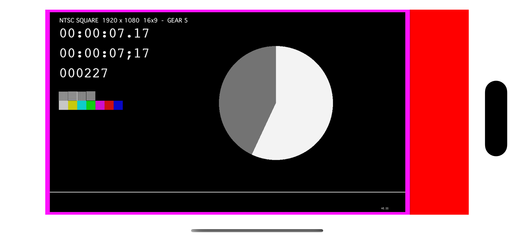

# Video player

This is a demo project for rendering a video stream on Metal layer by using MetalKit and AVFoundation. It supports iOS and macOS.

## Development

The project is a SwiftUI project, and it uses `NSViewRepresentable`/`UIViewRepresentable` to display a MTKView and implement the delegate methods of it. To simplify the implementation `RenderController` is responsible to the initialization of Metal layer and AVPlayer, and the loading and rendering of the stream.

The project is tested with the example streams that Apple provides: https://developer.apple.com/streaming/examples/.

## Demo

